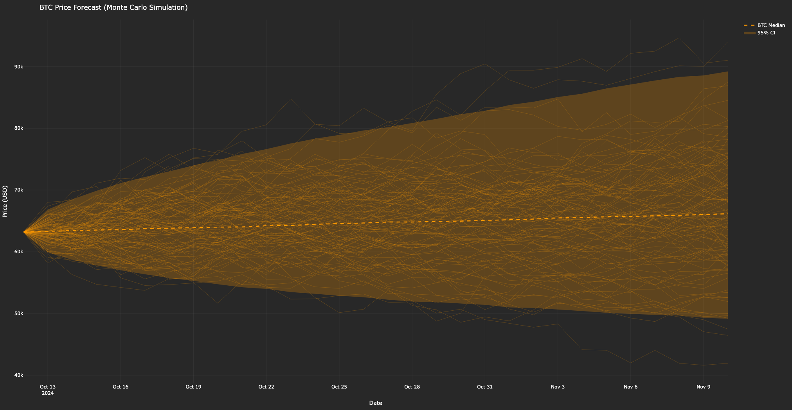
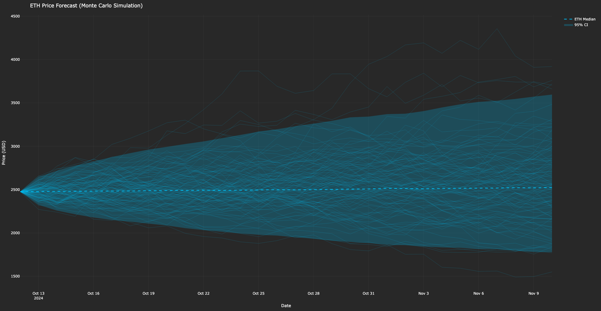
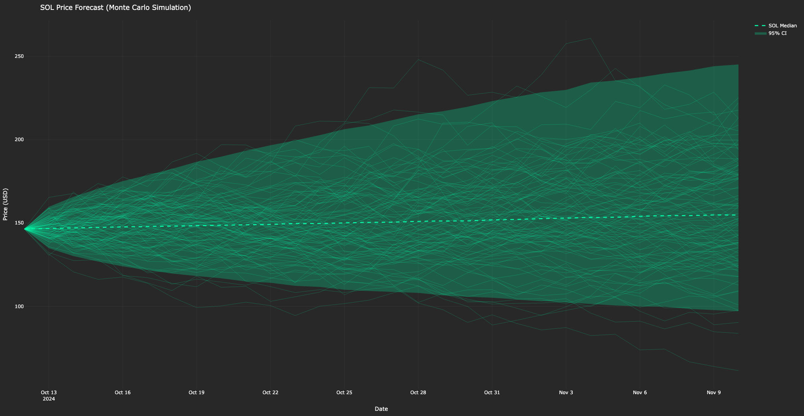
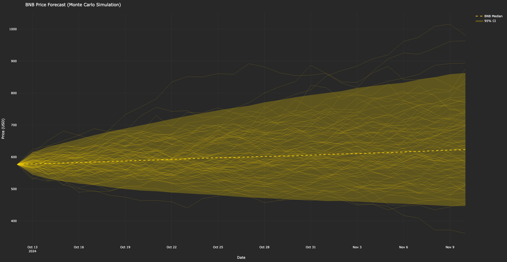

# crypto_montecarlo_forecast

- This project predicts future prices of major cryptocurrencies using Monte Carlo simulation with Geometric Brownian Motion (GBM).
- It fetches historical data, simulates future price paths, and visualizes the forecasts with confidence intervals.

---

## Files
- `crypto_forecast.py`: Main script for fetching data, running simulations, and generating visualizations.
- No external dataset required; data is fetched live from Binance via `ccxt`.
- `btc.png`: Visualization of Bitcoin (BTC) price forecast - Color: `#FF9900`
- `eth.png`: Visualization of Ethereum (ETH) price forecast - Color: `#00B7EB`
- `sol.png`: Visualization of Solana (SOL) price forecast - Color: `#00FFAA`
- `bnb.png`: Visualization of Binance Coin (BNB) price forecast - Color: `#FFD700`

---

## Libraries Used
- `numpy`
- `pandas`
- `plotly.graph_objects`
- `ccxt`
- `datetime`

---

## Timeframe
- **Input**: Historical data from **2024-01-01** to **2024-10-12** (configurable in code).
- **Output**: Forecasts prices for the next **30 days** from the end date.

---

## Features
- Fetches real-time cryptocurrency data from Binance.
- Calculates annualized return (mu) and volatility (sigma) based on daily returns.
- Simulates **10,000 price paths** per cryptocurrency using GBM.
- Visualizes results with median forecast and **95% confidence intervals**.

---

## Screenshots

